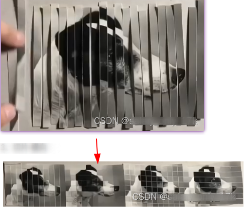
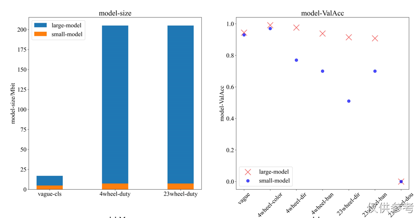
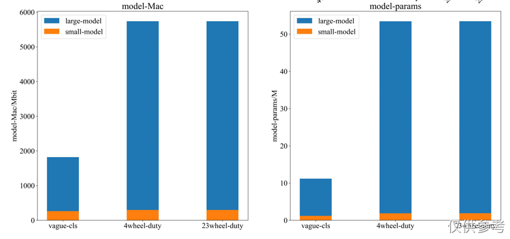
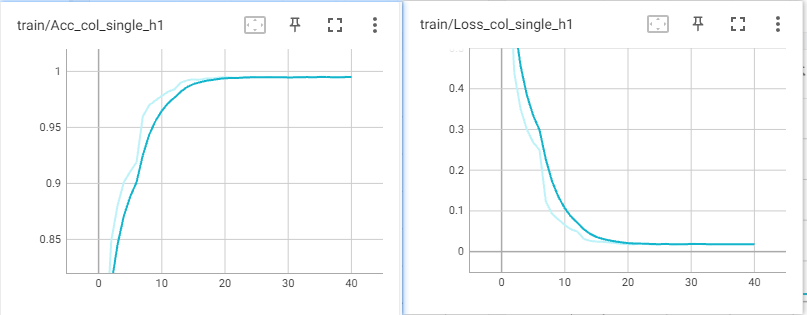
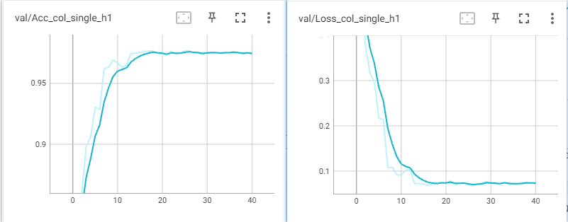
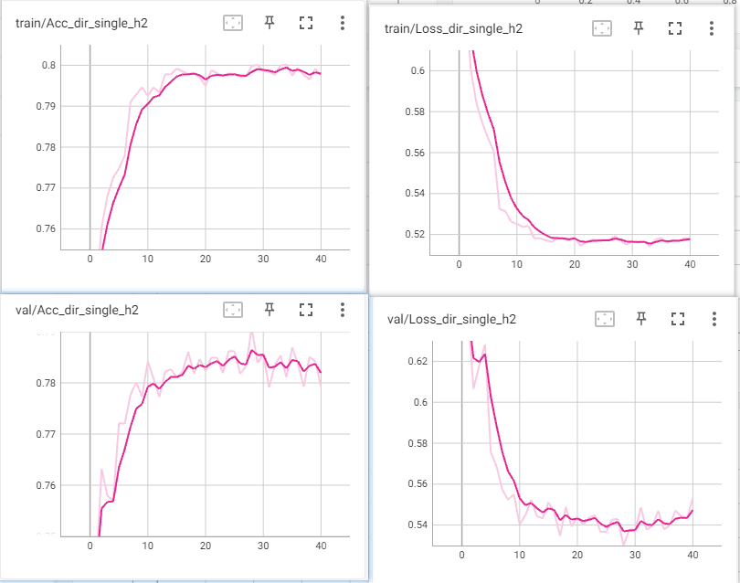
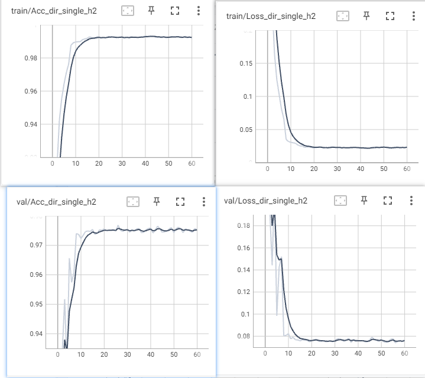

这是一个比较成熟的多头分类模型，经历了很多测试。当前版本已经接近最终版本。

当前版本的特征提取网络借鉴了[yolov5-6.2](https://github.com/ultralytics/yolov5/tree/v6.2)改写。十分感谢作者作出的共享。

这个代码在某个边缘设备项目中，得到了应用。精度高，效果不错。

注意：代码里可能会有bug，需要你去自己去修改。

---

**目录**

[toc]

---

# 1 快速开始

## 1.1 名词解释

这个项目中设计到了一些名词。下面简单做下解释：

**多源数据：**在一个多任务模型中，多个dataline数据流。一个图像对应一个或者多个标签，称作为一个dataline。

**同源数据：**在一个多任务模型中，只有一个dataline数据流。一个图像包含任务所有需要的标签。

**多任务异步训练：**多任务模型的多个head，同时训练，直到所有的heads首先稳定。

**多任务同步训练：**多任务模型的多个head，分别训练，一个head收敛后，训练下一个。

## 1.2 训练环境

```bash
pip install -r requirements.txt -i https://pypi.tuna.tsinghua.edu.cn/simple
```

不要使用torch-1.10和torch-1.12版本，这个版本有问题。torch-1.10在同步训练多头分类时候，会造成不明原因的显存溢出。torch-1.12在使用torch.onnx.export转onnx模型时候，网络结构会出错。这里建议使用torch-1.8或torch-1.9版本。

## 1.3 数据准备

待处理数据格式：

一个图像对应多个标签，用于多分类模型。

```text
images\
        car\
            car-whole\   
                car-head\       imgs...
                car-tail\       imgs...
                car-unk\        imgs...
            car-half\           imgs...
        bus\
            bus-whole\   
                bus-head\       imgs...
                bus-tail\       imgs...
                bus-unk\        imgs...
            bus-half\           imgs...
        truck\
            truck-whole\  
                truck-head\     imgs...
                truck-tail\     imgs...
                truck-unk\      imgs...
            truck-half\         imgs...
```

一个图像对应一个标签，用于单分类模型。

```text
images\
        car\        imgs...
        bus\        imgs...
        truck\      imgs...

```

在path/to/cope_下面，我提供了我自己处理数据的代码，可以作为参考，修改自己的代码。

```sh
python run_cope_img2Mulitlabels.py    # 一个图像对应多个标签
python run_cope_img2Singlelabel.py    # 一个图像对应一个标签
```

处理完的数据格式为：

```
images\
        train\
            00000_0_1_2_.jpg
            00001_0_0_1_.jpg
            00002_0_0_0_.jpg
        val\
            00000_0_1_2_.jpg
            00001_0_0_1_.jpg
            00002_0_0_0_.jpg
        test\
            00000_0_1_2_.jpg
            00001_0_0_1_.jpg
            00002_0_0_0_.jpg
```

或

```
images\
        train\
            00000_0_.jpg
            00001_1_.jpg
            00002_0_.jpg
        val\
            00000_0_.jpg
            00001_0_.jpg
            00002_0_.jpg
        test\
            00000_1_.jpg
            00001_1_.jpg
            00002_0_.jpg
```

## 1.4 训练

yolov5-cls训练

## 1.5  推理

## 1.6 部署

```bash
python to_onnx.py
```

onnx -> tr

```bash
sh to_trt.sh
```

# 2 代码设计思路

yolov5-mcls多分类的backbone采用的是yolov5的backbone。

yolov5-cls作为应用在边缘设备上的二级模型，需要满足参数小，计算量小，精度高的要求。在使用他之前，我尝试了resnet18，densenet，EfficientNet_v1,EfficientNet_v2,mobilenet_v3,xception等都做实验，参数量、计算量和精度都不满足要求，

这里不仅仅是简单的yolov5的backbone应用，也做了修改。

```python
all_net = {"yolovv5_62cls_s":[yolov5n_cls_s, yolov5s_cls_s, yolov5l_cls_s,  yolov5m_cls_s,],
            "yolov5_62cls_m":[yolov5n_cls_m, yolov5s_cls_m, yolov5l_cls_m, yolov5m_cls_m,],
            "yolov5_62cls_l":[yolov5n_cls_l, yolov5s_cls_l, yolov5l_cls_l, yolov5m_cls_l],
      
            "yolov5_62cls_s_dp":[yolov5n_cls_s_dp, yolov5s_cls_s_dp, yolov5l_cls_s_dp, yolov5m_cls_s_dp,],
            "yolov5_62cls_m_dp":[yolov5n_cls_m_dp, yolov5s_cls_m_dp, yolov5l_cls_m_dp, yolov5m_cls_m_dp,],
            "yolov5_62cls_l_dp":[yolov5n_cls_l_dp, yolov5s_cls_l_dp, yolov5l_cls_l_dp, yolov5m_cls_l_dp],

            "yolov5_62cls_s_dw":[yolov5n_cls_s_dw, yolov5s_cls_s_dw, yolov5l_cls_s_dw, yolov5m_cls_s_dw,],
            "yolov5_62cls_m_dw":[yolov5n_cls_m_dw, yolov5s_cls_m_dw, yolov5l_cls_m_dw, yolov5m_cls_m_dw,],
            "yolov5_62cls_l_dw":[yolov5n_cls_l_dw, yolov5s_cls_l_dw, yolov5l_cls_l_dw, yolov5m_cls_l_dw],
      
            "yolov5_62cls_st":[yolov5n_cls_st,yolov5s_cls_st,yolov5l_cls_st,yolov5m_cls_st],
            "yolov5_62cls_dw":[yolov5n_cls_dw,yolov5s_cls_dw,yolov5l_cls_dw,yolov5m_cls_dw],
            "yolov5_62cls_dp":[yolov5n_cls_dp,yolov5s_cls_dp,yolov5l_cls_dp,yolov5m_cls_dp],
          }
```

yolovv5_62cls_s、yolov5_62cls_m和yolov5_62cls_l分别对应多头模型的小量级模型，中量级模型和大量级模型。小量级模型是写了多个分类器，中量级模型是把backbone最后一层结构+分类器，大量级模型在中量级模型的基础上，分别给每个喂入数据加了独立的卷积结构。三个两级模型下面还有分别用了yolov5-s、n、l和m作为backbone。这里所有的卷及都是使用的是普通卷积。

yolovv5_62cls_s_dp、yolov5_62cls_m_dp和yolov5_62cls_l_dp，几乎和上面的一样，唯一区别是，这里所有的conv3x3都换成conv3x1和conv1x。

yolovv5_62cls_s_dw、yolov5_62cls_m_dw和yolov5_62cls_l_dw，几乎和上面的一样，唯一区别是，这里所有的conv3x3都换成深度可分离卷积。

yolov5_62cls_st、yolov5_62cls_dw和yolov5_62cls_dp都是一个分类head的。

## 2.1 考虑参数量和计算量

为了减小参数，考虑可以做了如下修改：

1. 对conv3x3卷积的权重做矩阵分解，分解成conv3x1 + conv1x3 + conv1x1，这种方法几乎不会改变模型精度；
2. 对conv3x3卷积改成深度可分离卷积；
3. 无fc层。

## 2.2  考虑收敛问题

为了加快2-head和3-head的收敛，提高精度，做了如下修改：

1. 采用yolov5-5.0的浅层结构： Focus，增加数据量和复杂度。
2. 对cls-head部分，去掉globalavgpool，改成两层conv。
3. 每个数据输入元，单独设计基层数据层。



## 2.3 训练报告

其中large为resnet50三头分类模型，small为yolov5n-clsn模型。

下图Fig. 1左图为模型大小可视化柱状图，单位为Mbit，右图为各个模型在验证集上准确率的散点图。

在精度问题上，小模型没有大模型高的原因，原因是数据，训练小模型需要更多更丰富的数据。



Fig. 1

下图FIg. 2 左图为各个模型计算复杂度柱状图，单位为Mbit。右图为模型参数量柱状图，单位为M。



Fig. 2

图Fig. 3和图Fig. 4分别是yolov5n-clsn模型1-head在一个11类（4wheel-col）分类任务上的表现，数据量14万。



Fig. 3



Fig. 4

下面看一个三分类（车头，车尾和横向）在小模型上的变现。



验证集上78%多，性能很难提升。

相同的数据在大模型上的表现，性能轻松到了98%以上。



另外，在小模型上，训练结果更加不好看。二分类精度仅有63%。

另外的另外，设计小模型并作训练时候，就有这样的一个要求。必须数据丰富，耦合性高。

## 2.4 训练技巧

1 如果训练多头分类模型，我推荐的使用异步训练。优点很多：

- 节省gpu显存，一个显卡就能训练；
- 可以有个更加稳定的backbone，分布不同的数据，相互影响backbone的收敛，为了达到某种平衡，虽然我设计了动态平衡系数，精度提升难度很大，特别是三个head的数据不均衡时候。
- 训练速度更快。如果多分类同步训练，数据分布不同，依旧会有相互影响，一直收敛附近中徘徊，并且loss降不下去.

2 异步训练也有技巧可言。训练head-1时候，尽量使用数据量大的，类别多的数据去训练，这样训练出来的backbone表达能力更加丰富。

3 如果head-2和head-3表达能力不够，怎么办？可以使用堆叠head-2和head-3中的conv结构，增加层深。

4 如果用怎么训练发现分类头收敛不理想，可以用一个复杂的数据去训练head-1，然后用自己的数据去训练head-1、head-2和head-3。

# 3 改进与展望

下面介绍几个改进方向，本人精力有限，没办法做到面面具到。

1. 多分类同步训练可以采用分布式训练，但是我前面也说了同步训练多个head收敛情况不容易达到最优解。在异步训练中，有模仿hybridnet的训练方式，最后一轮训练是所有head一起训练，如果异步训练不能满足你，可以最后一步加上这个办法；
2. 为了加快训练，可以使用混合梯度缩放（torch.cuda.amp）。在yolov5中，作者做了64个batch-size后更新梯度，可以模仿；
3. 可以尝试新的检测模型--yolov6和yolov7的backbone，替换掉这里的backbone；
4. ~~对比学习和度量学习、gan网络对于分类学习很有用，特别是对于小网络。其中，我尝试了用对比学习去做，需要改动的地方是（1）把globavgpool+fc层改为两个conv层；（2）损失函数选择的somftmax。~~
5. yolov5-5.0中已经有了分类头，当初我模仿做了一个分类模型。方法很简单，就是把汇总到检测头的内容给了分类头。效果还不错。但是有个问题，参数量比较大。

# 4 更新内容

- 测试了resnet_gai;
- 测试了densenet_gai;
- 测试了efficientnet_gai、efficientnetv2_gai;
- 测试了mobilenetv2_gai、mobilenetv3_gai;
- 测试了yolov5-5.0分类。

resnet_gai是指对resnet网络的修改，主要是添加了多个分类器。同理，其他的也是这个意思。目前这些代码都放在 path/to/nets/experiment下面，

yolov5-5.0分类这个是比较特殊的，把第9层的ssp替换成Conv，分类器接受来之第5层、第7层和第9层的输出经过Classify（5.0和6.2的这个函数是不一样的，这里我做了修改）计算，相加到一起，通过一个fc层去做分类。把这个过程是做一个分类器。多头则需要重复去写。

这个是yaml配置文件

```xml
# Parameters
nc1: 4  # number of classes
nc2: 3  # number of classes
nc3: 2  # number of classes
depth_multiple: 0.33  # model depth multiple
width_multiple: 0.25  # layer channel multiple
anchors:
  - [10,13, 16,30, 33,23]  # P3/8
  - [30,61, 62,45, 59,119]  # P4/16
  - [116,90, 156,198, 373,326]  # P5/32

# YOLOv5 v6.0 backbone
backbone:
  # [from, number, module, args]
  [[-1, 1, Conv, [64, 6, 2, 2]],  # 0-P1/2
   [-1, 1, Conv, [128, 3, 2]],  # 1-P2/4
   [-1, 3, C3, [128]],
   [-1, 1, Conv, [256, 3, 2]],  # 3-P3/8
   [-1, 6, C3, [256]],
   [-1, 1, Conv, [512, 3, 2]],  # 5-P4/16
   [-1, 9, C3, [512]],
   [-1, 1, Conv, [1024, 3, 2]],  # 7-P5/32
   [-1, 3, C3, [1024]],
   [-1, 1, Conv, [1024, 3, 2]],  # 9
  ]

# YOLOv5 v6.0 head
head:
  [
   [[5, 7, 9], 1, Classify, [nc1]],  # classify
   [[5, 7, 9], 1, Classify, [nc2]],  # classify
   [[5, 7, 9], 1, Classify, [nc3]],  # classify
  ]
```

Classify函数改写

```python3
class Classify(nn.Module):
    # Classification head, i.e. x(b,c1,20,20) to x(b,c2)
    def __init__(self, c1, c2, k=1, s=1, p=None, g=1):  # ch_in, ch_out, kernel, stride, padding, groups
        super().__init__()
        c_ = 1280  # efficientnet_b0 size
        self.conv = Conv(c1, c_, k, s, autopad(k, p), g)
        self.pool = nn.AdaptiveAvgPool2d(1)  # to x(b,c_,1,1)
        self.drop = nn.Dropout(p=0.0, inplace=True)
        self.linear = nn.Linear(c_, c2)  # to x(b,c2)

    def forward(self, x):
	x = x  if isinstance(x,list) else [x]
	out_lst = []
	for xi in x:
	    out_lst.append(self.pool(self.conv(xi)))
        out = torch.cat(out_lst, 1)
        return self.linear(self.drop(out).flatten(1)))
```

# 5 其他应用

* 对yolov5修改，det+seg
* 对yolov5修改，det+cls
* 对yolov7修改，det+seg

# 6 参考

YoloP

Yolov6（det+seg）

hybbridnet。
